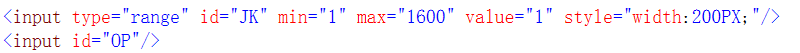
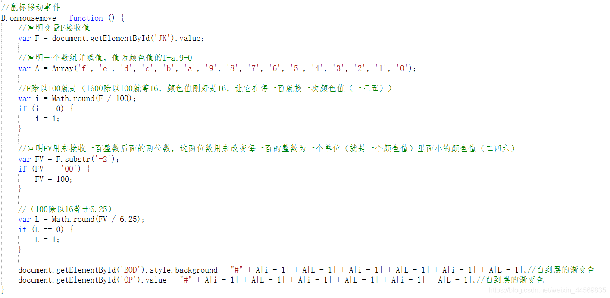
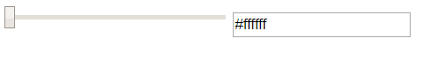

# Input标签type=’range’的使用

**Input标签type=’range’的使用**

使用input标签的range类型，改变背景颜色。首先准备两个input标签，一个类型是range用来滑动,一个类型是文本用来显示数据用的。给类型是range设置一些样式，id为JK，min最小值，max最大值，value设置为1，如果没有设置value那么它默认在中间，设置为1就让它和我设置的最小值一样，那么它的开始点就在最左侧，也可以设置在其它地方，按你的需求来赋值，值在你设置的最小值和最大值中间就行，它的开始点会跟你赋的值发生改变。然后再给另外一个input标签一个id为OP，input标签默认的类型就是文本，所以可以忽略。这样我们就准备好了HTML部分的代码了。

HTML代码截图：

页面代码就是上图那样那么简单，学完HTML就写JS部分。

首先声明一个D的变量用来接收上面ID为JK的input标签，获取到JK之后给它一个鼠标移动事件，再声明一个F用来接收ID为JK的input标签，因为鼠标每移动一次我就要重新获取它的值，声明A数组并赋值，值为颜色值的f-a,9-0。我要用到的颜色值是从#ffffff到#000000（颜色从白到黑），最大颜色值为f,最小颜色值为0，颜色值为六位数,，用到的是从#ffffff->#fefefe（一三五，二四六），从左侧开始数，先二四六开始减，从f减到0，二四六减完一次后，就到一三五减一位，然后再从二四六开始减从f减到0，然后一三五再减一位，以此类推。然后再声明i来接收（一三五）的颜色值，声明L来接收（二四六）的颜色值，最后赋值。详情代码看下图：

页面效果截图：
效果1：

效果2：
