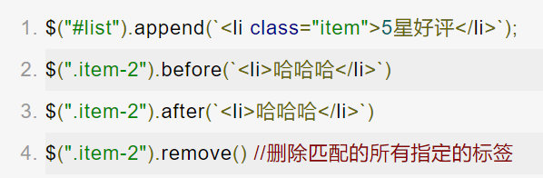

# jQuery常用命令

1. `$("css选择器")`

通过jQuery获取到的是一个类数组的jQuery的对象。

在 jQuery 中，当你使用类似 `$(selector)` 的语法去选择元素时，返回的不是一个纯粹的 DOM 元素，而是一个包含这些元素的特殊 jQuery 对象。这个对象有点像数组，因为你可以用索引（比如 `[0]`，`[1]` 等等）来访问其中的每一个元素。但它不是一个真正的数组。

### 类数组（Array-like）

"类数组"意味着这个对象有一个 `length` 属性，也可以用索引来访问元素，就像数组一样。但它没有数组的方法，如 `push`、`pop`、`slice` 等。

### jQuery 对象

这个 "类数组的 jQuery 对象" 除了类数组特性外，还具有许多 jQuery 特有的方法，如 `.html()`、`.css()`、`.on()` 等。

### 例子

假设你有多个类名为 `.item` 的元素：

```html
<div class="item">Item 1</div>
<div class="item">Item 2</div>
```

用 jQuery 选择这些元素：

```javascript
const items = $('.item');
```

现在，`items` 是一个类数组的 jQuery 对象。你可以这样获取其第一个元素：

```javascript
const firstItem = items[0];  // 这是一个纯粹的 DOM 元素
```

或者使用 jQuery 方法：

```javascript
items.html('New Content');  // 这会更新所有 .item 元素的 HTML 内容
```


----------------------------------------------


- `html()`：操作标签的内容（类似于innerHTML）
- `text()`：操作标签的内容（类似于innerText）
- `val()`：操作表单元素的内容（类似于value）
- 注意：
  - 如果是获取类型的api，一般是针对获取的第一个标签
  - 如果是设置类型的api，是针对所有匹配的标签进行操作


- `append()`：作为父标签的最后一个子标签新增到页面中
- `before()`：在指定的兄弟标签之前添加一个新标签
- `after()`：在指定的兄弟标签之后添加一个新标签
- `remove()`：删除指定的标签




- `attr()`：获取或设置普通的原生属性
- 获取：jquery标签变量名.attr(“属性名”)

- 修改：jquery标签变量名.attr(“属性名”,”属性名”)
- 修改多个：

```js
jquery标签变量名.attr(

{

属性名1:"属性值",

属性名2:"属性值",

属性名3:"属性值",

}

)
```


-----


#### 特殊的布尔属性

##### 获取值： true或false

```js
  jQuery的标签变量名.prop("属性名")
  设置值：
  jQuery的标签变量名.prop("属性名",true或false)
```


---

### 如何选择自定义属性？

在 CSS 和 JavaScript 中，可以使用属性选择器来选择具有特定 `data-id` 属性的元素。

### 在 CSS 中

你可以使用以下语法：

```css
/* 选择所有具有 data-id 属性的元素 */
[data-id] {
  /* CSS 规则 */
}

/* 选择 data-id 属性值为 "123" 的元素 */
[data-id="123"] {
  /* CSS 规则 */
}
```

### 在 JavaScript 中

使用原生 JavaScript：

```javascript
// 选择第一个具有 data-id 属性的元素
const element = document.querySelector('[data-id]');

// 选择所有具有 data-id 属性的元素
const elements = document.querySelectorAll('[data-id]');

// 选择 data-id 属性值为 "123" 的元素
const specificElement = document.querySelector('[data-id="123"]');
```

使用 jQuery：

```javascript
// 选择所有具有 data-id 属性的元素
const $elements = $('[data-id]');

// 选择 data-id 属性值为 "123" 的元素
const $specificElement = $('[data-id="123"]');
```


事件委托：

1. `父标签jquery标签变量名.on("事件类型", "触发事件标签的css选择器", function () {`
2. `    console.log($(this));//this获取的是当前触发click事件的标签`
3. `})`


## jQuery的遍历

- 语法：

```js
 jquery标签变量名.each(function(index,elem){
      index：代表标签的下标
      elem：代表的是当前的标签，获取的是原生的js对象，需要使用$()转化后才能调用jQuery的方法
  })
```


例子：

```js
  $("[type=checkbox]").each(function (index, elem) {
      // $(原生获取的标签) 可以转为jQuery对象
      // console.log(index, $(elem));
      console.log($(elem).val());
  })
```

