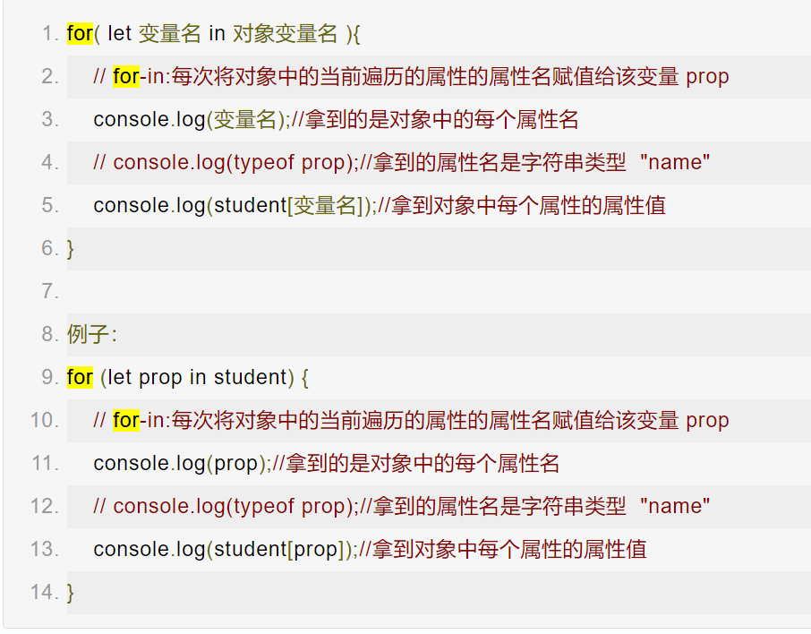

# ‘for循环’家族

---


#### for循环遍历

- 语法：

  ```javascript
  for(let i=0; i< 字符串.length;i++){    
      console.log(字符串[i])
  }
  ```


### for…of  （ES6提出的）

- 用于`字符串`遍历，是ES6提出的——-推荐使用

- 语法


### for-in

- 获取`对象`中每个属性的值，通过`for-in`来遍历对象

- 语法：

  


### forEach()

- `数组`专属遍历，可以用来替代for循环遍历数组

- 语法

  


