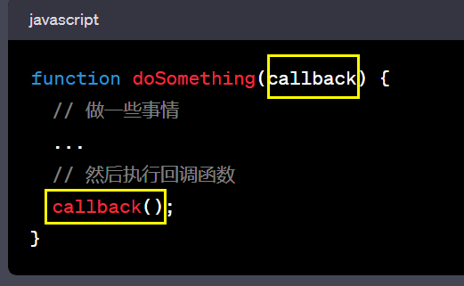
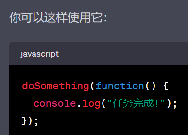
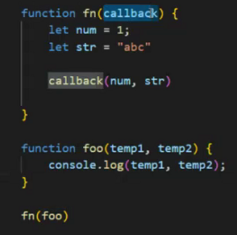
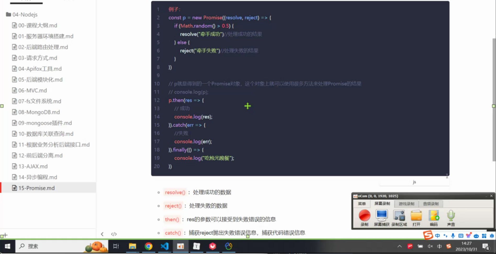

# 把一个函数作为参数传递给另一个函数时，那个函数就叫做“回调函数”

---

```js
 function doSomething(callback) {

 // 做一些事情

//  ...

 // 然后执行回调函数

 console.log("我是任务");

 callback();

}

doSomething(function() {

 console.log("任务完成!");

}); 
```


---







foo就是回调函数(callback)




Promise：

