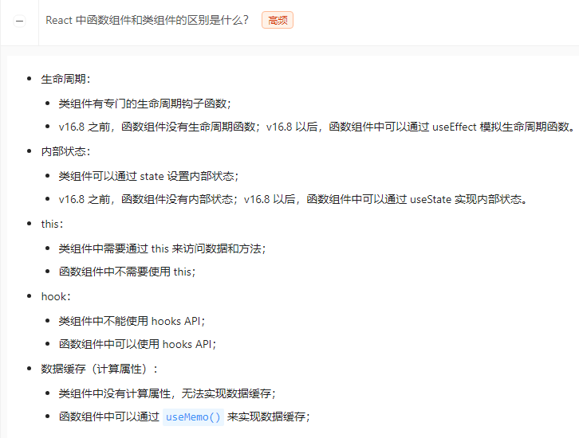
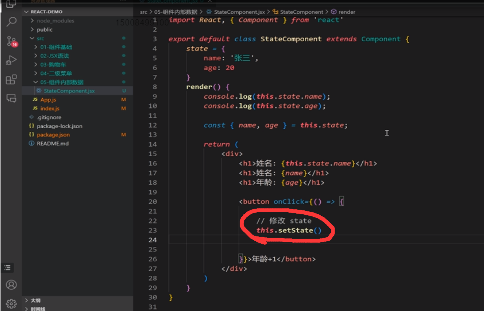

**React 组件具有三大属性，即：`state`、`props`、`refs`**


**Vuex 的核心属性**

- `state`：存储应用级别的状态，即数据。state 是响应式的，可以在组件中使用 $store.state 来访问。
- `getters`：用于派生状态，即计算属性。相当于 Vue 组件中的计算属性。getters 也是响应式的。
- `mutations`：用于修改 state 中的数据。mutations 中的方法必须是同步的，可以通过 commit 方法来触发 mutations 中的方法。
- `actions`：用于处理异步操作和业务逻辑。actions 中的方法可以是异步的，可以通过 dispatch 方法来触发 actions 中的方法。
- `modules`：将 store 分割成模块，每个模块拥有自己的 state、getters、mutations 和 actions。






setState是react官方提供的修改数据的方法 微信小程序的setData就是学他的 setState应该是类组件的，函数组件应该是使用use开头的hook ↓


在没有引入Redux时，React组件通过内部状态（state）来实现自我管理（每个类组件都是个状态机）。每个组件都可以定义自己的状态，并在需要时更新这些状态。这是通过使用`useState`钩子（在函数组件中）或`this.state`和`this.setState`（在类组件中）来实现的。以下是一些基本的方法，组件如何在没有Redux的情况下管理状态：

1. **使用`useState`钩子**：在函数组件中，你可以使用`useState`来创建状态变量。例如：

   ```javascript
   const [count, setCount] = useState(0);
   ```

   这里，`count`是状态变量，而`setCount`是一个函数，用于更新`count`的值。

2. **使用`this.state`和`this.setState`**：在类组件中，你可以在构造函数中初始化状态，并使用`this.setState`方法来更新状态。例如：

   ```javascript
   class Counter extends React.Component {
     constructor(props) {
       super(props);
       this.state = { count: 0 };
     }
   
     incrementCount = () => {
       this.setState({ count: this.state.count + 1 });
     };
   
     render() {
       return (
         <button onClick={this.incrementCount}>
           {this.state.count}
         </button>
       );
     }
   }
   ```

3. [**状态提升**：当多个组件需要访问相同的状态时，可以将状态提升到它们共同的父组件中，然后通过`props`将状态传递给子组件。这样，父组件可以充当单一的状态源](https://zh-hans.react.dev/learn/managing-state)[1](https://zh-hans.react.dev/learn/managing-state)[2](https://zh-hans.react.dev/learn/sharing-state-between-components)。

4. **组件组合**：可以通过组件组合来共享状态逻辑，例如使用高阶组件（HOCs）或自定义钩子来封装和重用状态逻辑。

5. [**上下文（Context）API**：对于跨多层级的组件树共享状态，可以使用React的Context API来避免`props`的逐层传递](https://zh-hans.react.dev/learn/sharing-state-between-components)[2](https://zh-hans.react.dev/learn/sharing-state-between-components)。

这些方法允许组件以声明式的方式管理和更新状态，而不需要像Redux那样的外部状态管理库。然而，当应用程序变得复杂，状态在多个组件或深层组件之间共享时，使用像Redux这样的库可以帮助更好地组织和维护状态。

​              