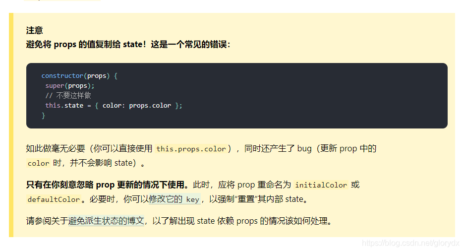
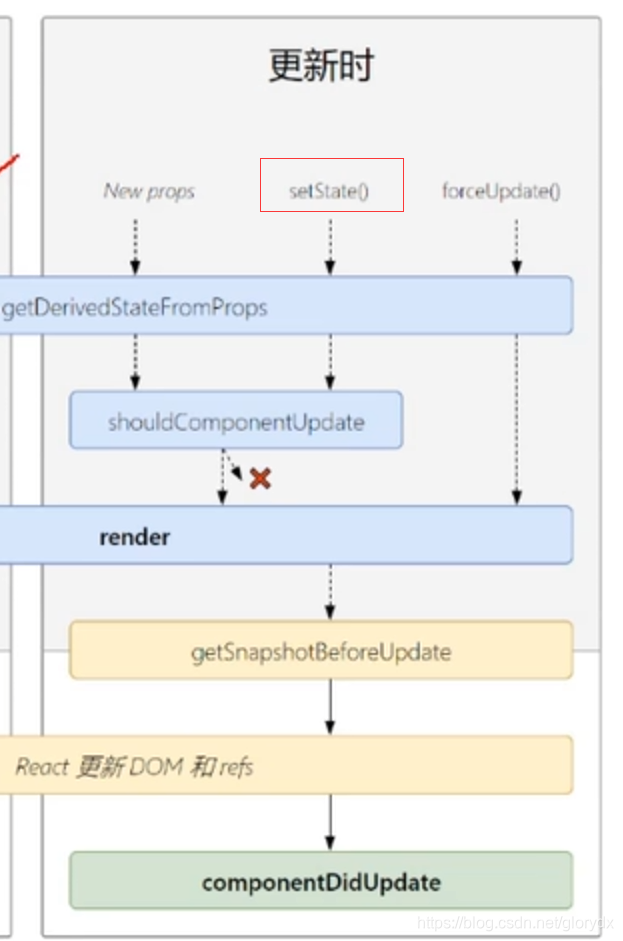

# react 玩转state和setState

[react](https://so.csdn.net/so/search?q=react&spm=1001.2101.3001.7020)的组件分为两种，函数式组件和类式组件，函数式组件现在可以有自己的状态，通过useState hook的方式，但没有state，类式组件才有state。


### class组件state状态[初始化](https://so.csdn.net/so/search?q=初始化&spm=1001.2101.3001.7020)

初始化state指的是组件挂载时，在没有用户交互的情况下，state保存的值。
两种初始化state的方式


#### 开发中实际使用的一种方式

```typescript
import React, { Component } from 'react'

export default class State extends Component {
    state = {
        name: 'dx',
        age: '18'
    }
    render() {
    	// 读取state中的状态，通过this.state
        const { name, age } = this.state
        return (
            <div>
                请叫我{name},今年{age}
            </div>
        )
    }
}
```

#### constructor初始化state

在constructor中初始化state，只有一种情况需要用到，当子组件的state第一次展示的初始值，来自于父组件传递过来的参数。

```javascript
import React, { Component } from 'react'

export default class State extends Component {
    constructor(props) {
        super(props)
        const {name, age} = props
        this.state = {
            name,
            age
        }
    }
    render() {
    	// 读取state中的状态，通过this.state
        const {name, age} = this.state
        return (
            <div>
                 请叫我{name},今年{age}
            </div>
        )
    }
}
```

其它情况下使用constructor就会显得特别麻烦，没必要

```react
import React, { Component } from 'react'

export default class State extends Component {
    constructor(props) {
        super(props)
        this.state = {
            name: 'dx',
            age: '18'
        }
    }
    render() {
    	// 读取state中的状态，通过this.state
        const {name, age} = this.state
        return (
            <div>
                 请叫我{name},今年{age}
            </div>
        )
    }
}
```

并且官方也并不建议，你将props的值赋值给state。

所以在constructor中初始化state，你基本用不上，也别这样写。

### 更新state状态

通过组件实例上的this.setState方法更新state的状态

```react
import React, { Component } from 'react'

export default class State extends Component {
    state = {
        name: 'dx',
        age: '18'
    }
    // 请一定要使用箭头函数,否则this不指向组件实例，this上也没有setState方法
    onClickChangeName = () => {
        this.setState({
        	// 合并旧的state数据进行更改，也就是说，age: '18'可以不用写,age数据仍然不会丢失，除非你同时希望变更age这一数据
            name: 'yx'
        })
    }
    render() {
        const { name, age } = this.state
        return (
            <div>
                请叫我{name},今年{age}
                <button onClick={this.onClickChangeName}>点击改变name</button>
            </div>
        )
    }
}
```

千万不要 直接通过this.state.name = 'yx’的方式去修改,你会发现这不会引起页面的更新。因为从生命周期的角度来讲，setState方法才会触发react更新流程执行，render才会被重新调用。

#### 关于setState

setState是挂载到react组件实例上的，所以通过this.setState()的方式调用。

setState可以接收两个参数，第一个参数你想要变更的state对象或者函数返回一个想要变更的state对象，第二个参数，state对象变更成功后的一个回调函数，可以拿到最新的state状态数据。

```react
import React, { Component } from 'react'

export default class State extends Component {
    state = {
        name: 'dx',
        age: '18'
    }
    // 请一定要使用箭头函数,否则this不指向组件实例，this上也没有setState方法
    onClickChangeName = () => {
        this.setState(() => {
            return {
                name: 'yx',
                age: '16'
            }
            // 同样使用箭头函数
        }, () => {
            console.log(this.state)
        })
    }
    render() {
        const { name, age } = this.state
        return (
            <div>
                请叫我{name},今年{age}
                <button onClick={this.onClickChangeName}>点击改变name</button>
            </div>
        )
    }
}
```

上面的例子展示了setState第一个参数以函数的形式来更新state，但这是强行在使用这种方式，并不合理，你不觉得如果只是对setState中的某一个值进行重新赋值，用函数返回更改的对象太麻烦了吗？

只有一种方式，你可能需要将setState的第一个参数以函数返回对象的形式进行。

**新的state数据需要在旧的state数据的基础上进行更新**

```react
import React, { Component } from 'react'

export default class State extends Component {
    state = {
        count: 0
    }
    // 请一定要使用箭头函数,否则this不指向组件实例，this上也没有setState方法
    onClickAdd = () => {

        this.setState(
   // 第一个参数是旧的state,第二个参数是组件接收的props,但第二个参数基本不用，因为官方也不推荐你通过props来赋值给state
        (state, props) => {
            return {
                count: state.count + 1
            }
        }, () => {
            console.log(this.state)
        })
    }
    render() {
        const { count } = this.state
        return (
            <div>
                <h1>{count}</h1>
                <button onClick={this.onClickAdd}>点击加1</button>
            </div>
        )
    }
}
```

#### 简单总结一下

1. this.setState()是一个异步调用，你无法在调用之后立刻拿到最新的state状态，如果想尽快拿到更新后正确的state数据，在setState的第二个参数，回调函数中拿。

```react
state = {
	name: 'dx'
}
this.setState({
	name: 'yx'
}, () => {
	console.log(this.state.name) // yx
})
console.log(this.state.name) // dx
```

你会发现dx先于yx在控制台上出现，这也进一步证明了this.setState()是一个异步的方法。

为什么this.setState()看起来像是异步的？
因为react不会每一次调用setState都去更新，而是采用了一种防抖的思想，某一段时间内（这个时间会很短，人无法明显感知），只执行最后一次的有效更新，避免重复调用，造成性能浪费。

**声明： setState实际上是一个同步中算异步，但在真正的异步方法里，又算同步。**

看完声明你可能很困惑，这需要你对底层原理比较熟悉，以及浏览器的事件循环机制。

1. setState尽量不使用第一个参数以函数的形式进行，因为以对象的形式也能满足需求，看个人习惯，看到这里是不是很郁闷，真有人看吗，我怀疑，哈哈。

```react
import React, { Component } from 'react'

export default class State extends Component {
    state = {
        count: 0
    }
    // 请一定要使用箭头函数,否则this不指向组件实例，this上也没有setState方法
    onClickAdd = () => {
        this.setState(
        	{
        		// 这样不也能实现吗，哈哈
				count: this.state.count + 1	
			}, 
			() => {
            console.log(this.state)
        })
    }
    render() {
        const { count } = this.state
        return (
            <div>
                <h1>{count}</h1>
                <button onClick={this.onClickAdd}>点击加1</button>
            </div>
        )
    }
}
```

### 说点跟state相关的东西

在state初始化的时候，组件的props的值不要直接赋值给state值，官网也说了可以直接使用props。
**否则** props的值即使更改了，state的值也不会改变(因为这只是初始化，只执行一次，当父组件传过来的值发生变化时，只会重新render，但不会重新初始化state，state的更新只能由本组件的this.setState控制)
**但是** 如果某一个数据，必须由父组件传递过来的参数进行初始化，又得由子组件进行控制更新该怎么办呢。
使用 **static getDerivedStateFromProps()**
关于 static getDerivedStateFromProps官网介绍 https://zh-hans.reactjs.org/docs/react-component.html#static-getderivedstatefromprops

后面我也会写一篇博客介绍生命周期，其中会包含 getDerivedStateFromProps

#### 遇见的坑

**一、千万不要在 render() componentDidUpDate() componentWillUpDate() 生命周期中无条件的调用setState方法，页面会不断渲染更新。**

```react
render() {
// 条件不要一直为真。
 if(...) {
      this.setState({...})
  }
}

```

因为setState方法的调用会触发更新的生命周期流程重新执行,如果你在这些生命周期里面也无条件调用setState，那就是没有退出条件的无限递归。


**二 、为何用setState更新了数据，页面还是不更新呢**
如果你是用 this.state.xxx = xxx 这样更新state，页面肯定无法更新，请使用setState。

如果你用了setState，还是无法更新，那你可能犯了下面这种错误： **没有改变state的值在栈中保存的内容。**

```react
import React, { Component } from 'react'

export default class State extends Component {
    state = {
        count: {
			value: 0
		}
    }
    // 请一定要使用箭头函数,否则this不指向组件实例，this上也没有setState方法
    onClickAdd = () => {
    	this.state.count.value = this.state.count.value + 1 
        this.setState(
        	{
        		// 将旧state的count对象赋值给新的count，其实count在栈中的值没变过。
				count: this.state.count
			}, 
			() => {
            	console.log(this.state)
        	})
    }
    render() {
        const { value } = this.state.count
        return (
            <div>
                <h1>{value }</h1>
                <button onClick={this.onClickAdd}>点击加1</button>
            </div>
        )
    }
}

```

正确的方式应该是

```react
import React, { Component } from 'react'

export default class State extends Component {
    state = {
        count: {
			value: 0
		}
    }
    // 请一定要使用箭头函数,否则this不指向组件实例，this上也没有setState方法
    onClickAdd = () => {
        this.setState(
        	{
        		// 给count一个新的对象。
				count: {
					value: this.state.count.value + 1 
				}
			}, 
			() => {
            	console.log(this.state)
        	})
    }
    render() {
        const { value } = this.state.count
        return (
            <div>
                <h1>{ value }</h1>
                <button onClick={this.onClickAdd}>点击加1</button>
            </div>
        )
    }
}

```

复杂类型数据（对象，数组）必须改变其在栈中的值，react才认为你的state是更新了的（因为react只对前后的state的值做了浅比较），才会触发页面的更新。