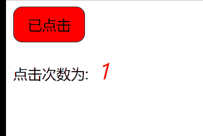

# React类组件三大属性（state,props,ref）

## 1、State(状态)

> 概念：state是组件对象最重要的属性,值是对象(可以包含多个key:value的组合)，组件被称为`状态机`,通过更新组件的state来更新对应的页面显示(重新渲染组件)，有state称为复杂组件。

***\*State 的使用对象形式(key,value)；\****

例如：

```react
state ={
 
a: 10
 
}
```

绑定事件的方法：

```react
<a href='javascript:;' onClick={demo} >已关注</a>
```


> **说明：**
>
> - onclick 变为 onClick。
> - {函数名}返回值给click，加()就会直接调用。


### **修改state值**

**必须要使用 setState 方法修改state中的值**

```react
demo( ){
 
    this.setState({isflag:!this.state.isflag})
 
}
 
 }
 
 ReactDOM.render(<MyClass/>,document.getElementById('hello'));
```

> **说明：**
>
> - bind会生成一个新的方法 并传对象 改变this的指向
> - 必须使用setState 修改才有效，修改内容为合并。有值得修改没有的不动

### 小案例

```react
<!DOCTYPE html>
<html lang="en">

    <head>
        <meta charset="UTF-8">
            <meta http-equiv="X-UA-Compatible" content="IE=edge">
                <meta name="viewport" content="width=device-width, initial-scale=1.0">
                    <title>setState的用法</title>
                    <style>
                        button{
                            width: 80px;
                            height: 40px;
                            border-radius: 10px;
                            border: none;
                            border: 1px solid #333;
                            font-size: 16px;
                        }
                        span{
                            color: red;
                            font-size:  24px;
                            font-style:italic;
                            margin-left: 10px;
                        }
                        .yes{
                            background: red;
                        }
                        .no{
                            background: green;
                        }
                    </style>
                    </head>

                <body>
                    <div id="root"></div>

                    <script src="../JS/react.development.js"></script>
                    <script src="../JS//react-dom.development.js"></script>
                    <script src="../JS/babel.min.js"></script>

                    <script type="text/babel">
                        // 利用类式组件
                        class Person extends React.Component {
                            // 类式组件中用来存储数据的地方，类似vue中的data,
                            // 因为数据可以多种，所以采用对象的形式，
                            // 又因为是在一个类中，所以很多书写习惯类似在定义类
                            state ={
                                flag: true,
                                count: 1
                            }
                            // 因为是类，所以还是按照类中函数的书写形式，但要注意写成箭头函数形式
                            clickNumber = ( )=>{
                                // 要改变state中的数据，需要使用setState方法
                                // 但也有可能改变的数据较多，所以可以采用对象的形式，
                                // 这里的修改是合并修改，即有该属性就改变该属性的值，若没有则不改变
                                this.setState({flag: !this.state.flag,
                                               count: ++this.state.count})
                            }
                            render() {
                                return (
                                    <div>
                                        <button className={this.state.flag?'yes':'no'} onClick={this.clickNumber}>{this.state.flag ? '已点击':'未点击'}</button>
                                        <p>点击次数为:<span>{this.state.count}</span></p>
                                    </div>
                                )
                            }
                        }
                        // 转为真实dom到页面
                        ReactDOM.render(<Person />, document.getElementById('root'));
                    </script>

                </body>

                </html>

```



## 2、props

### **基础用法**

> - 每个组件对象都会有props(properties的简写)属性。
> - 组件标签的所有属性都保存在props中。
> - props 是不可变的，只能通过 props 来传递数据。
>
> **具体使用方式如下：**

```react
<script type="text/babel">
    // 类式组件
    class Person extends React.Component {
        // 提交事件的函数,要写成箭头函数
        submit=(event)=>{
            // 去除默认事件
            event.preventDefault();

            console.log(123);
        }
        render() {
            // 获取props的值
            const {realname,age} = this.props;
            return (
                <div>
                    <form action="" >
                        姓名: <input type="text" value={realname}/>
                        <br/>
                        <br/>
                        年龄: <input type="text" value={age}/>
                        <br/>
                        <br/>
                        <button onClick={this.submit}>提交信息</button>
                    </form>
                </div>
            )
        }
    }
    // 渲染真实dom到页面上
    ReactDOM.render(<Person realname="Taylor Swift" age={30}/>, document.getElementById('root'));
</script>
```

批量传递参数

```react
let p1 = {name:'张三',age:29};
 
ReactDOM.render(<Person {...p1}/>,document.getElementById('hello'));
```

## 3、ref的使用

**定义：组件内的标签可以定义ref来标识自己。**

### **字符串形式的ref**

```react
<script type="text/babel">
    // 类式组件
    class Person extends React.Component {
        realname = React.createRef();
        age = React.createRef();
        submit = (event) => {
            // 去除默认事件
            event.preventDefault();

            // 字符串形式的ref的获取方式——这里的refs没有$，要和vue区别开来
            console.log(this.refs.realname.value,this.refs.age.value);

        }
        render() {
            return (
                <div>
                    <form action="">

                        姓名：<input type="text" ref="realname"/>
                        年龄：<input type="text" ref="age" />
                        <br />
                        <br />
                        <input type="button" value="提交信息" onClick={this.submit} />
                    </form>
                </div>
            )
        }
    }
    // 渲染真实dom到页面中
    ReactDOM.render(<Person />, document.getElementById('root'));
</script>
```

### **回调函数下ref**

```react
<script type="text/babel">
    // 类式组件
    class Person extends React.Component {
        realname = React.createRef();
        age = React.createRef();
        submit = (event) => {
            // 去除默认事件
            event.preventDefault();

            // 字符串形式的ref的获取方式——这里的refs没有$，要和vue区别开来
            // console.log(this.refs.realname.value);
            // 或函数形式的ref的获取方式
            console.log(this.realname.value);
            // 获取createRef形式的ref
            // console.log(this.realname.current.value);
        }
        render() {
            return (
                <div>
                    <form action="">
                        {
                            /*
                                姓名：<input type="text" ref="realname"/>
                                年龄：<input type="text" ref="age" />
                                姓名：<input type="text" ref={(event) => { this.realname = event }} />
                                年龄：<input type="text" ref={(event) => { this.age = event }} />
                                 姓名：<input type="text" ref={this.realname} />
                            <br />
                            <br />
                            年龄：<input type="text" ref={this.age}   />
                                */
                        }
                        姓名：<input type="text" ref={(event) => { this.realname = event }} />
                        年龄：<input type="text" ref={(event) => { this.age = event }} />
                        <br />
                        <br />
                        <input type="button" value="提交信息" onClick={this.submit} />
                    </form>
                </div>
            )
        }
    }
    // 渲染真实dom到页面中
    ReactDOM.render(<Person />, document.getElementById('root'));
</script>
```

### **createRef** **创建ref****容器**

```react
<script type="text/babel">
    // 类式组件
    class Person extends React.Component {
        realname = React.createRef();
        age = React.createRef();
        submit = (event) => {
            // 去除默认事件
            event.preventDefault();

            // 字符串形式的ref的获取方式——这里的refs没有$，要和vue区别开来
            // console.log(this.refs.realname.value);
            // 或函数形式的ref的获取方式
            // console.log(this.realname.value);
            // 获取createRef形式的ref
            console.log(this.realname.current.value);
        }
        render() {
            return (
                <div>
                    <form action="">
                        {
                            /*
                                姓名：<input type="text" ref="realname"/>
                                年龄：<input type="text" ref="age" />
                                姓名：<input type="text" ref={(event) => { this.realname = event }} />
                                年龄：<input type="text" ref={(event) => { this.age = event }} />
                                 姓名：<input type="text" ref={this.realname} />
                            <br />
                            <br />
                            年龄：<input type="text" ref={this.age}   />
                                */
                        }
                        姓名：<input type="text" ref={this.realname} />
                        <br />
                        <br />
                        年龄：<input type="text" ref={this.age}   />
                        <br />
                        <br />
                        <input type="button" value="提交信息" onClick={this.submit} />
                    </form>
                </div>
            )
        }
    }
    // 渲染真实dom到页面中
    ReactDOM.render(<Person />, document.getElementById('root'));
</script>
```

