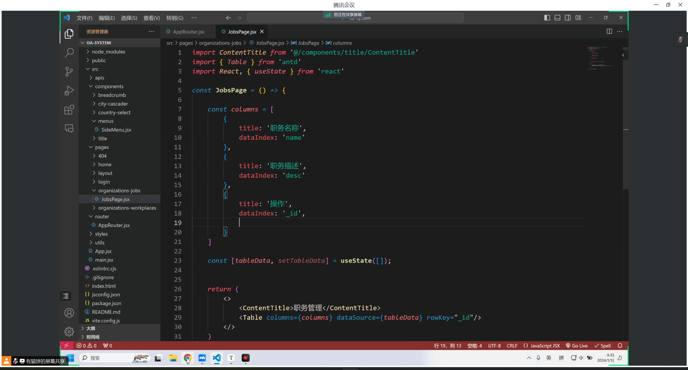
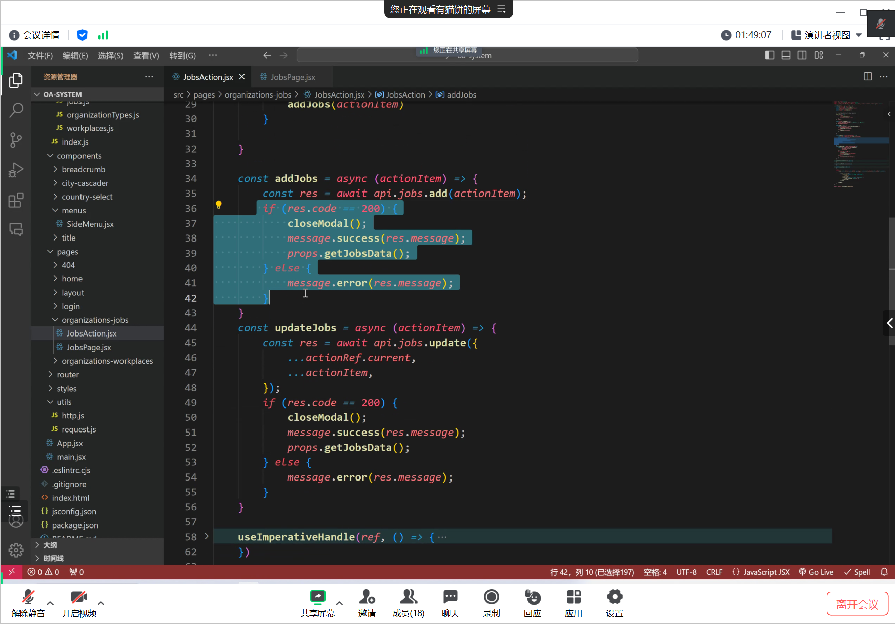

单独放 扩展 省空间

修改api 做汇总

设置checkboox （默认是checkbox 可以改单选radio）

onChange加上

动态设定 数量显示

受控组件才报错 需要加onCHange取消

这个是搜索栏 需要删减部分不要的

写一个空函数占位就不报错 记得引入图标

初始usestate是空的 onchange来改变 searchvalue做为参数传过去 、现在是分页的时候发请求 搜索的时候也要

保留旧分页数据

写删除，重新获取数据

调用删除

保存用户选择的ID 确保保存到全局 传入再删除

ant design的App组件包裹其他的

App.useapp引入message

组件顶层引入message是讲的第三种方法

---

新建JobsAction.jsx做弹窗

绑定ref  调用儿子方法打开弹窗

回显 没清空

添加强制渲染 消除form报错

有bug ref检测不到

把上一个修改的表单对象清空

---

### 菜单默认选中

新hook useLocation

浏览器访问路径和key作比较

取下标为1的 split分割的第二位才是要的单词

借助pathname和菜单之间有关联 设置默认选择与展开

