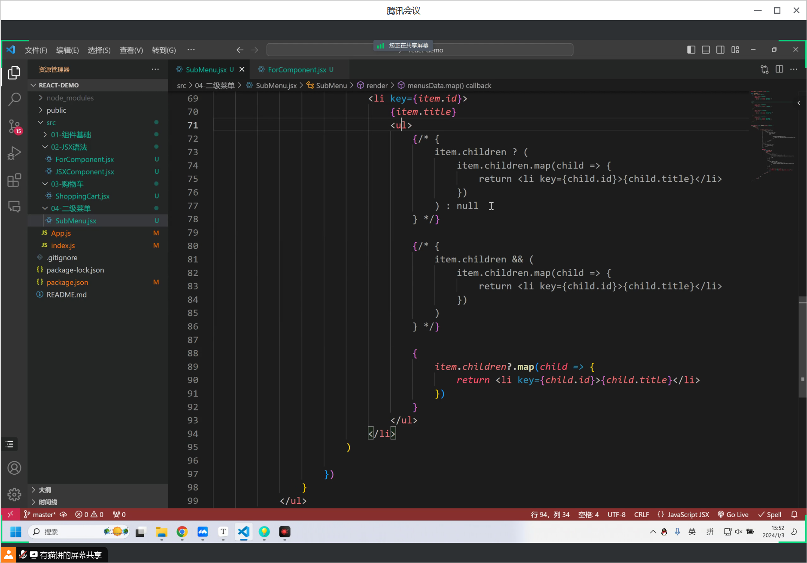

```react
 <ul>
          {
            arr.map((item, index) => {
              // 使用 item 来引用当前元素，而不是整个 arr 数组
              if (index === 3) {
                // 当索引为3时，返回一个加粗的列表项
                return <li key={index}><strong>{item}</strong></li>;
              }
              // 其他情况下返回普通的列表项
              return <li key={index}>{item}</li>;
            })
          }
 </ul>
```


条件渲染举例

