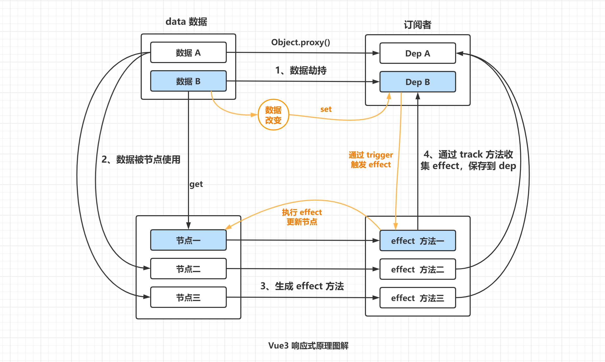

# Vue3的响应式原理

Vue3 在响应式的实现思路和 Vue2 的差别并不大，主要就是两点：

1. 劫持数据的方式，从 Vue2 的 `Object.defineProperty()` 改成用 `Object.Proxy()` 实现；
2. 收集的依赖的方式，由 watcher 实例变成了组件副作用渲染函数 effect。

---

---

#### Vue3里响应式原理的优势：

> Proxy 可以直接监听整个对象的变化，而不需要遍历对象的每个属性进行劫持。这使得 Vue 3 在处理大型数据对象时具有更高的性能。尤其是复杂数据类型的时候，Vue2数据劫持需要递归完成。实现对每一个属性进行劫持。对于性能消耗还是比较大。
>
> Object.defineProperty实现了对象属性的劫持，但是检测不到属性的新增和删除，也检测不到数组通过下标的方式来操作数据。proxy不存在这个问题。
>
> Vue 3 的响应式系统经过重写和优化，优化了虚拟dom，代码体积也更小。去除了很多Vue 2的冗余代码。相对来说性能更好一些。
>
> Vue 3 引入了 Composition API（组合式api），使用起来更加灵活，根据业务情况自己按需加载api开发。相比于vue的选项是api具有很好的可读性和可维护性。

