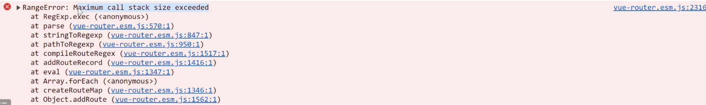
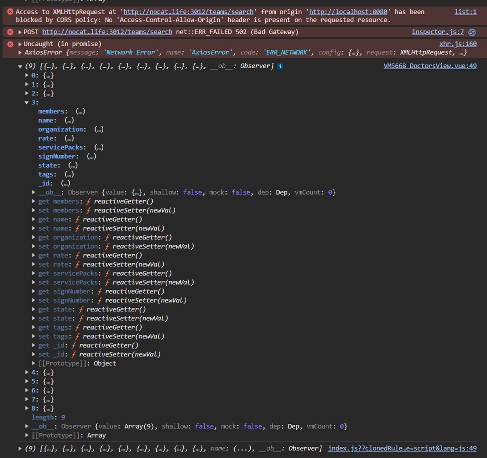
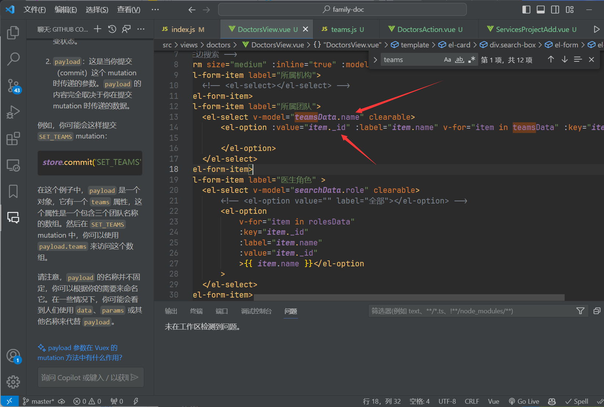

在应用外部的css中不能在内部写入分号

```vue
<style scoped lang="scss">
@import "./newWork.scss;";
</style>
```

否则会提示找不到文件

```vue
@import "./newWork.scss"; // 正确的方式
```

### 使用@ 导入**一定要    在结尾写上分号;**


在 `alert` 函数中使用了逗号而不是加号（`+`）或者模板字符串来连接字符串，这是导致打印不显示变量的内容的原因，正确写法是

```javascript
say2(name) {
    alert(`hello! ${name}`);
}
```


`v-if` 和 `v-show` 被同时使用在同一个元素上。这通常是不必要的，因为 `v-if` 和 `v-show` 都是用来根据条件渲染元素

`v-if：如果表达式的值为假，则不会渲染该元素及其子元素。
v-show：无论表达式的值如何，都会渲染该元素，但是会根据表达式的真假切换 CSS 的 display 属性。`


`new` 是 JavaScript 的保留字，不能将其用作变量名、导入别名或任何标识符.导入的组件别名不能使用new

```javascript
// 正确的导入语句，使用有效的标识符作为组件名
import NewWork from "./components/work/newWork.vue";
export default {
    name: "App",
    components: {
        // 将组件注册为NewWork
        NewWork
    },
    // ...其他选项...
};
```


不建议在标签中同时使用v-if 和 v-for 会报错

 Vue 的规则是 `<template>` 标签本身不应该有 `key`。`key` 应该被放置到实际渲染的元素上




死循环了


问题：v-model的下拉选择框里 点击选项后没有反应

在created中打印 **console**.log(this.teamsData); 查看teamsData的内容 其实报错是id的参数不正确 应该写成_id




