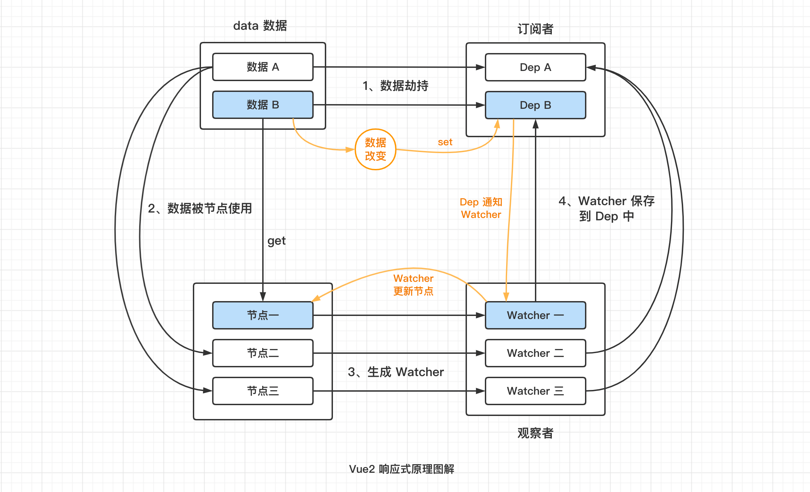

# Vue2 的响应式原理（双向数据绑定原理）

### 响应式系统是实现双向数据绑定的核心机制。所以面试中问“响应式原理”和“双向数据绑定原理”，基本上问的是同一个问题。

---

Vue2 的响应式原理主要分为“数据劫持”和“发布订阅者模式”两个步骤：

1. 数据劫持：通过 `Object.defineProperty()` 对 data 中数据进行数据劫持，分别给每一条数据添加 get 和 set 方法；
2. 发布订阅者模式：
   - 数据劫持时，会给每一条数据生成一个 Dep（订阅者）；
   - 当数据被节点使用时，数据的 get 方法执行，生成一个对应的 Watcher（观察者），并将 Watcher 保存到该数据对应的 Dep 中；
   - 当数据被修改时，数据的 set 方法执行，数据的 Dep 机会调用自己的 notify 方法，通知当前保存的所有 Watcher 更新页面；

图解如下：