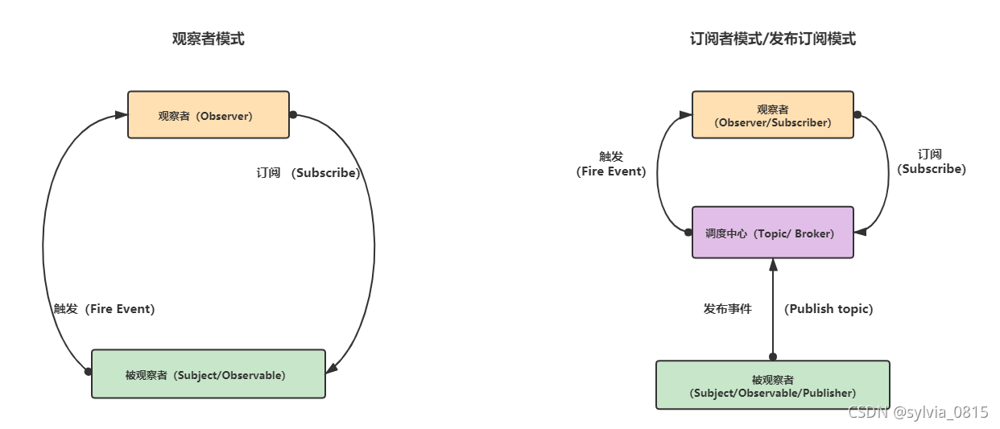

> `观察者模式`：
> 观察者（Observer）直接订阅（Subscribe）被观察者（Subject），而当被观察者被激活（点击，改变）的时候，会触发（Fire Event）观察者里的事件。它只需维护一套观察者（Observer）的集合，这些Observer实现相同的接口，Subject只需要知道，通知Observer时，需要调用哪个统一方法就好了。所以观察者模式是松耦合(loosely coupled)。

> `订阅者模式`：
> 也叫发布订阅模式。订阅者（Subscriber）把自己想订阅的事件注册（Subscribe）到调度中心（Topic），当发布者（Publisher）发布该事件（Publish topic）到调度中心，也就是该事件触发时，由调度中心统一调度（Fire Event）订阅者注册到调度中心的处理代码。发布订阅模式里，发布者和订阅者，不是松耦合，而是完全解耦（full decoupling）的。

**总结**

**从表面上看：**
观察者模式里，只有两个角色 —— 观察者 + 被观察者
而发布订阅模式里，却不仅仅只有发布者和订阅者两个角色，还有一个经常被我们忽略的 —— 经纪人Broker

**往更深层次讲：**
观察者和被观察者，是松耦合的关系
发布者和订阅者，则完全不存在耦合=

**从使用层面上讲：**
观察者模式，多用于单个应用内部
发布订阅模式，则更多的是一种跨应用的模式(cross-application pattern)，比如我们常用的`消息中间件`