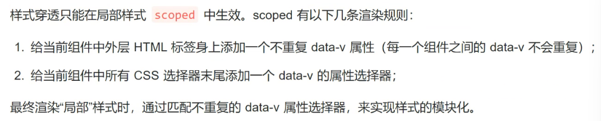

## Pinia 与 Vuex 3.x/4.x 的不同

- [mutations](https://www.zhihu.com/search?q=mutations&search_source=Entity&hybrid_search_source=Entity&hybrid_search_extra={"sourceType"%3A"answer"%2C"sourceId"%3A2777961855}) 不复存在。只有 state 、getters 、actions。
- actions 中支持同步和异步方法修改 state 状态。
- 与 TypeScript 一起使用具有可靠的类型推断支持。
- 不再有模块嵌套，只有 Store 的概念，Store 之间可以相互调用。
- 支持插件扩展，可以非常方便实现本地存储等功能。
- 更加轻量，压缩后体积只有 2kb 左右。

在`Vue`[生命周期](https://www.zhihu.com/search?q=生命周期&search_source=Entity&hybrid_search_source=Entity&hybrid_search_extra={"sourceType"%3A"article"%2C"sourceId"%3A"335143455"})钩子会自动绑定 `this` 上下文到实例中，因此你可以访问数据，对 `property` 和方法进行运算；这意味着**你不能使用[箭头函数](https://www.zhihu.com/search?q=箭头函数&search_source=Entity&hybrid_search_source=Entity&hybrid_search_extra={"sourceType"%3A"article"%2C"sourceId"%3A"335143455"})来定义一个生命周期方法**

当我们在浏览器中输入一个网址，例如： baidu.com ，按下回车键后，会发生什么呢？ 主要会发生以下这些过程：**域名解析（获取IP地址）、建立HTTP连接、发送HTTP请求、数据传输、渲染网页、断开HTTP连接**。

三次握手是TCP连接建立过程中的一个重要步骤，TCP连接又是浏览器发送HTTP请求的必要条件。

