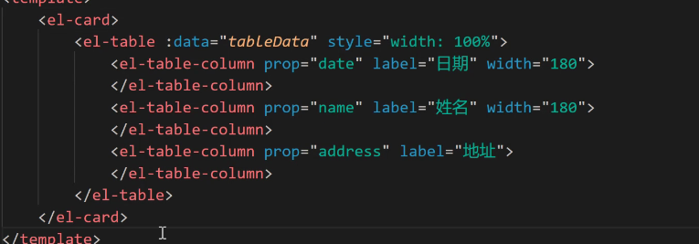

套一个card的list

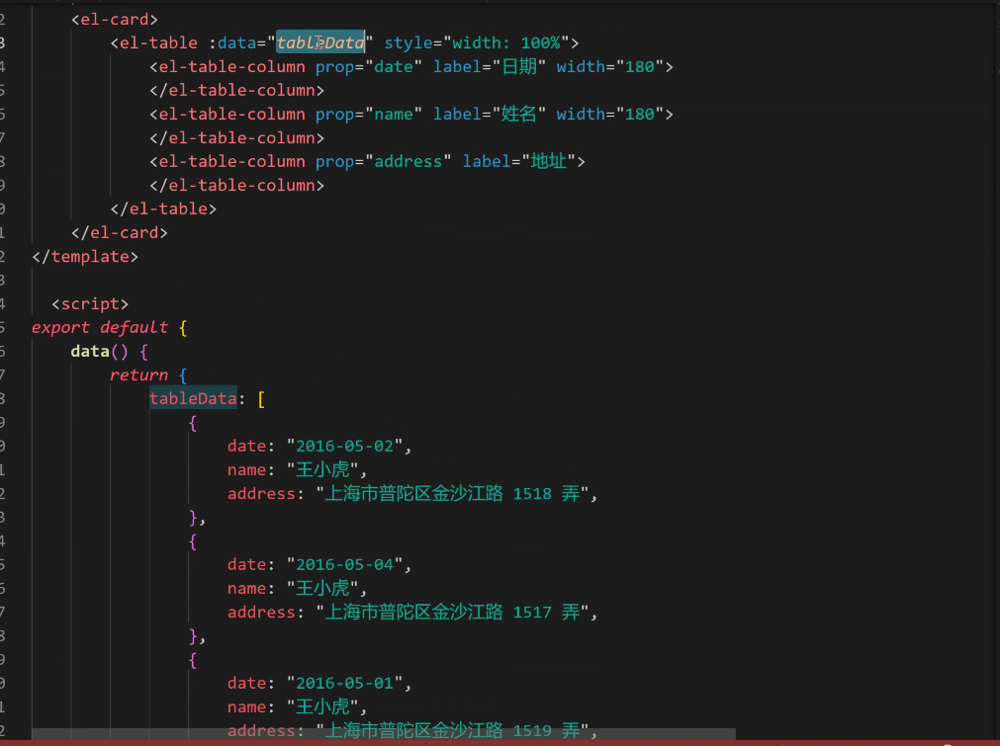

渲染表格

修改键名 可以去掉width 自适应宽度

列表最右边有 删除 和 编辑 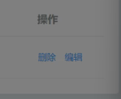

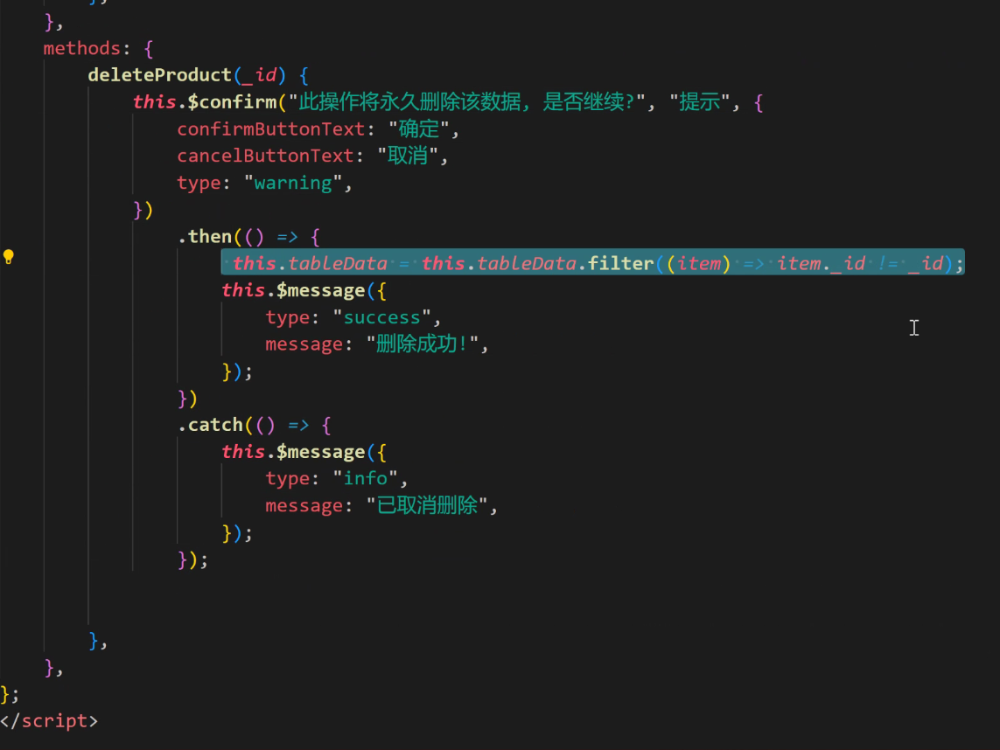

真正的删除代码放在then

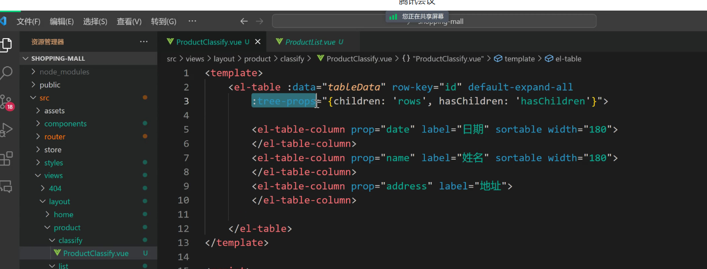嵌套数据在哪个children之上

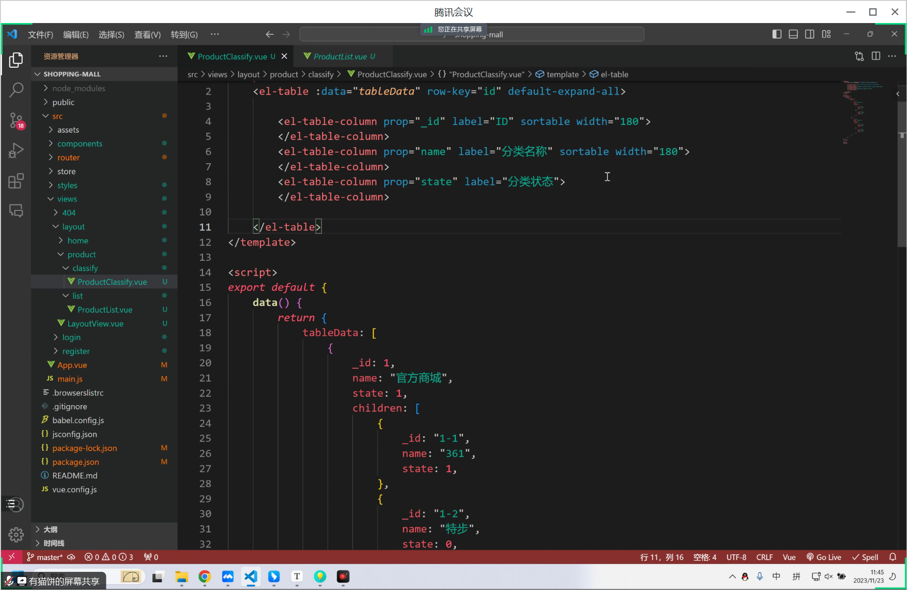

使用统一下划线_id

新增 的弹窗 ProductClasstify文件上设置的

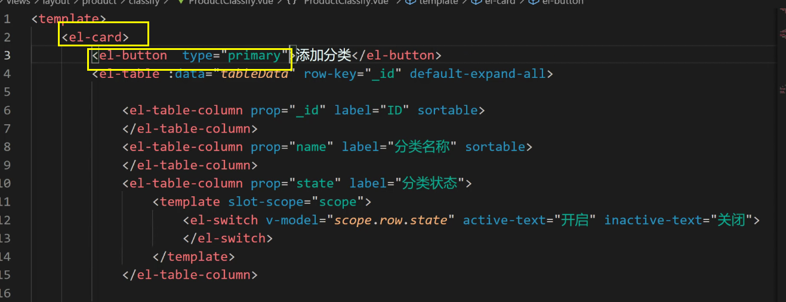

按钮和表格之间可以用div包裹然后内联margin bottom 10px

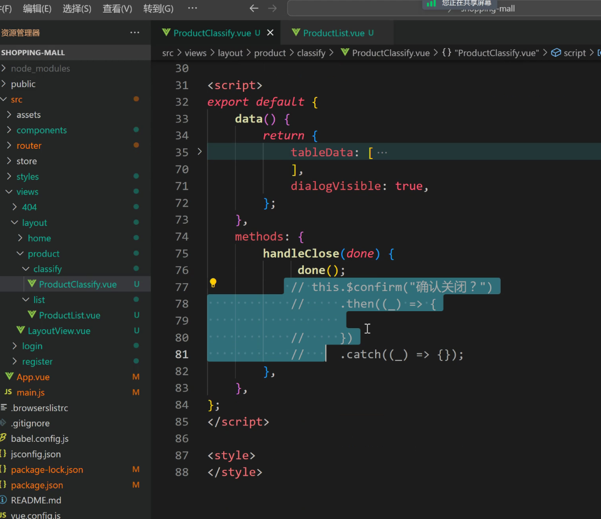

是否确认关闭？

对话框里需要表单

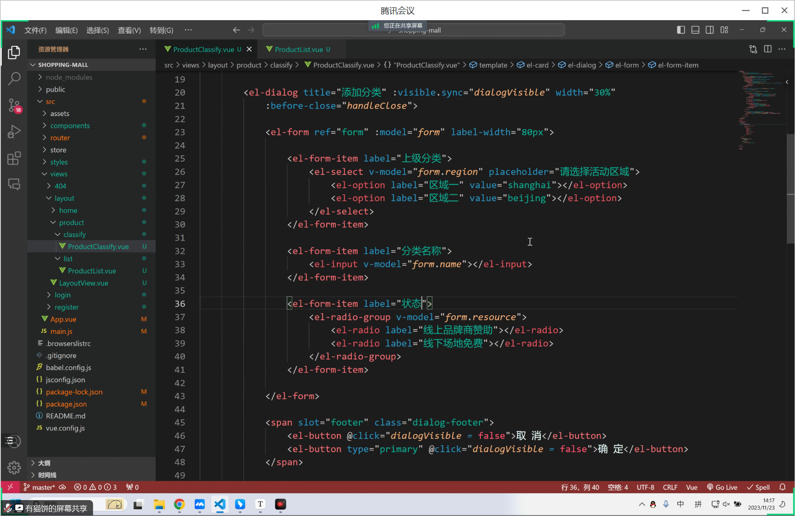

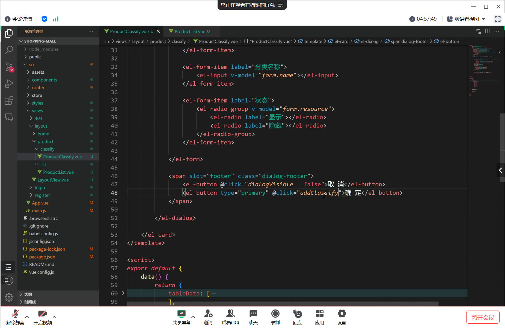

给一个新方法给完成分类的添加 不只是原来自带的操作完成自动关闭框

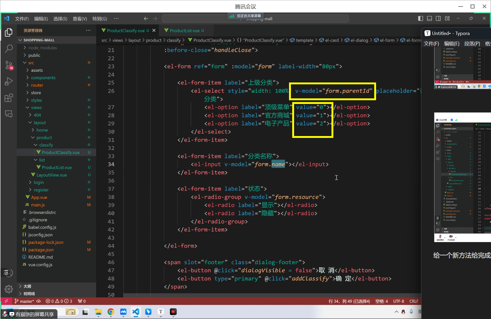

存放的是ID

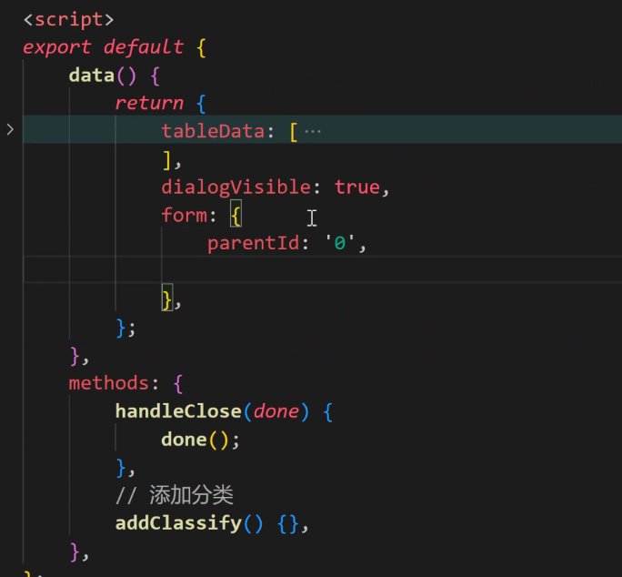

默认选中的是0号位 可以自定义

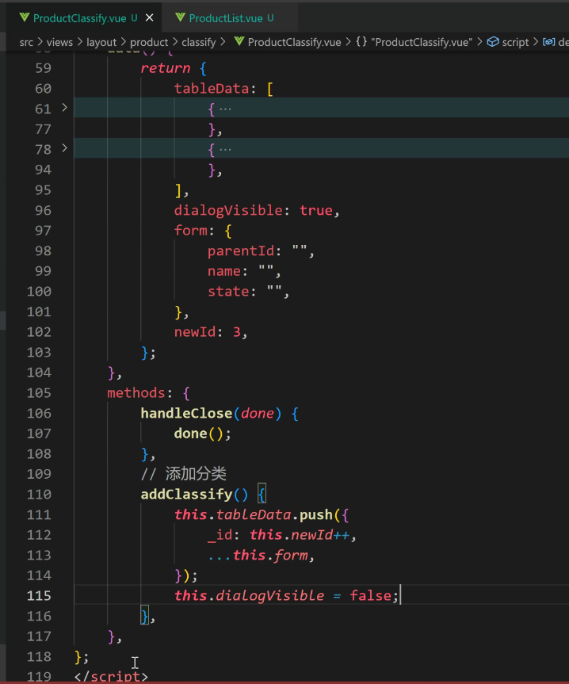

需要告诉他 1 0 代表什么 控制状态

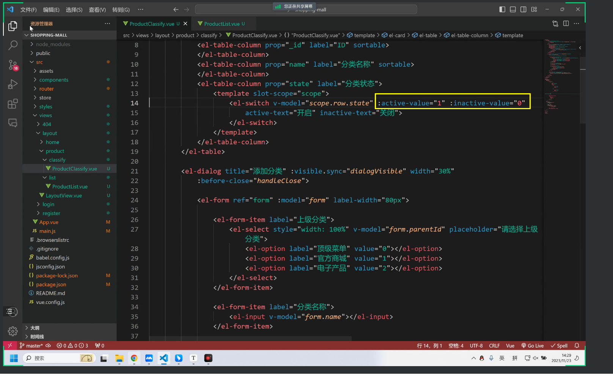

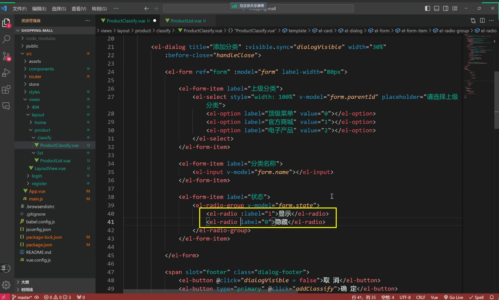

弹框内的radio联动

最后form表单清空