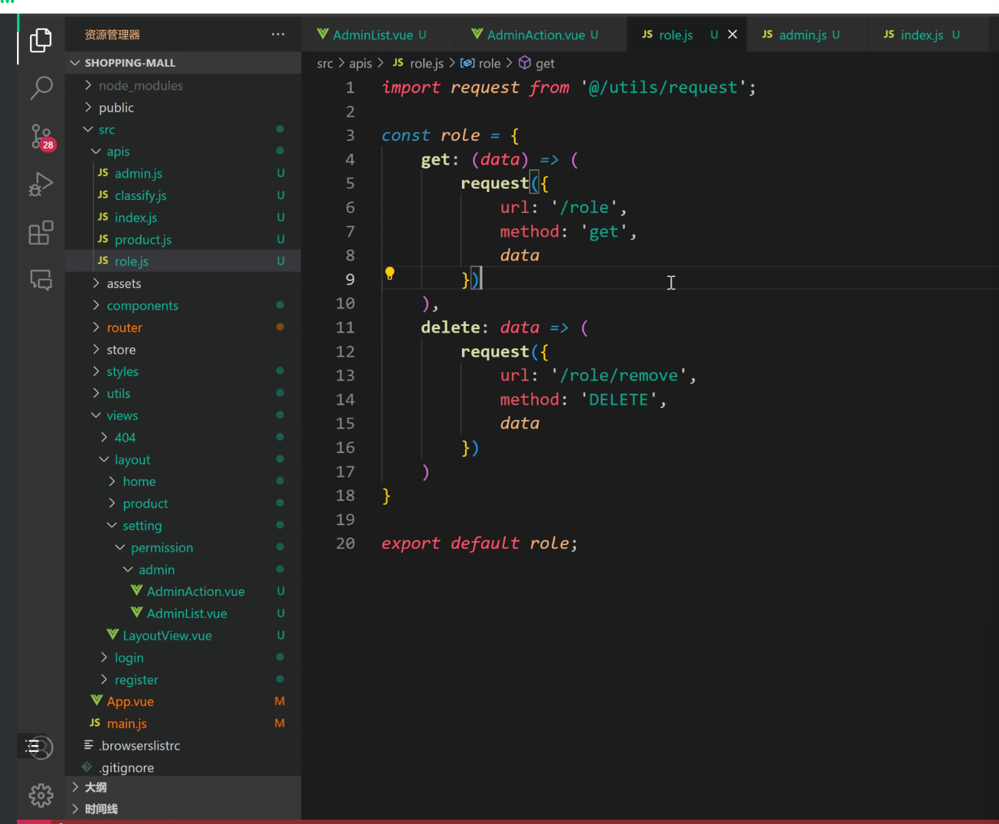
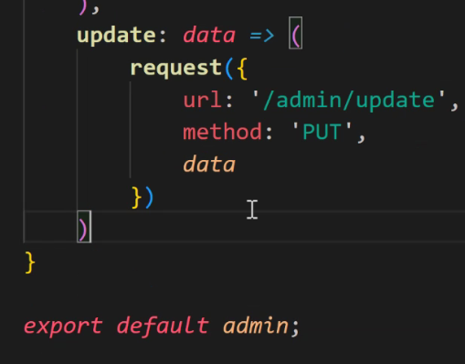
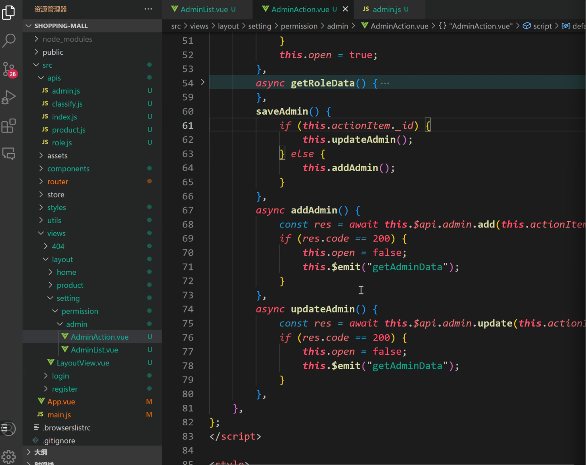

因为结果多样，返回的是对象  并不是每一个都是数组

3元运算的 控制页面上超级管理员 财务 等的“角色”背景颜色

单独给弹窗做一个组件

获取角色数据

下拉列表属性设置

新增和修改外面的api

数据是谁的 修改数据的方法就在哪里

打开弹窗 父传子

父组件传递的弹窗方法

回显数据

修改搞定 

dialog弹框的标题 修改 使用三目运算符

利用侦听的变化，清空表单

整一个权限数组，给每一个权限取个名字

这个是封装的那个axios的调用

如何渲染头像

添加

