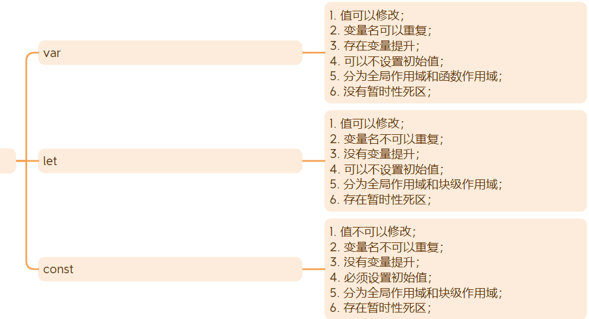

# JavaScript

### 1、哪些数据转换为布尔值之后为 false？

`空字符串`、`0`、`false`、`NaN`、`null`、`undefined`

---

### 2、ES6 的新特性。

1. let、const
2. 箭头函数、函数参数的默认值、不定参数
3. 模板字符串
4. Promise
5. async await
6. 解构赋值
7. 扩展运算符
8. 模块化（export default / import from）
9. 对象属性的简写
10. class
11. symbol
12. Set、Map

---

### 3、JS 的数据类型有哪些。

- 基本类型：number、string、boolean、null、undefined、symbol、bigInt
- 引用类型：object (包了function)

---

### 4、var、let、const 的区别。

| 区别       | var                    | let                    | const                  |
| ---------- | ---------------------- | ---------------------- | ---------------------- |
| 作用域     | 全局作用域、函数作用域 | 全局作用域、块级作用域 | 全局作用域、块级作用域 |
| 变量提升   | 有                     | 没有                   | 没有                   |
| 重复声明   | 可以                   | 不可以                 | 不可以                 |
| 定义初始值 | 可选                   | 可选                   | 需要                   |
| 重新赋值   | 可以                   | 可以                   | 不可以                 |
| 暂时性死区 | 没有                   | 有                     | 有                     |

### 5、数组的 API 中，哪些会改变原数组？哪些不会。

- 会改变：push、pop、unshift、shift、splice、sort、reverse
- 不会改变：join、slice、concat、includes、indexOf、find、forEach、map、filter、some、every、reduce...

### 6、改变 this 指向的方式有哪些？区别是什么。

- `call()`：改变 this 指向的同时立即执行函数；参数依次传递，用逗号分隔；
- `apply()`：改变 this 指向的同时立即执行函数；参数以一个数组的形式传递；
- `bind()`：返回一个改变 this 指向后的新函数（不会执行函数）；参数依次传递，用逗号分隔；

### 7、基本类型和引用类型的区别。

- 存储位置：基本类型的数据保存在`栈空间`，引用类型的数据保存在`堆空间`；
- 数据赋值：基本类型的数据在赋值时是进行“数据值”的传递（**值传递**），引用类型的数据在赋值时是进行的“引用地址”的传递（**址传递**）；
- 数据比较：基本类型的数据是比较“数据值”是否相等，引用类型的数据是比较“引用地址”是否相等；

### 8、== 和 === 的区别。

- == 在进行比较之前，**会隐式的将数据转换为同一个类型**，然后再进行值和类型的比较；
- === 直接对值和类型进行比较；

### 9、new 关键字的工作步骤。

1. 创建空对象；
2. 将函数内的 this 指向当前对象；
3. 将对象的 `__proto__` 指向函数的 `prototype`；
4. 执行函数内部代码；

5. 返回对象；

### 10、Promise 的方法。

1. `then`：Promise 状态变成“已成功”时，执行该方法；
2. `catch`：Promise 状态变成“已失败”时，执行该方法；
3. `finally`：Promise 状态变成“已成功”或“已失败”时，执行该方法；

同时处理多个 Promise 对象：

1. `all([])`：数组中的所有 Promise 状态为“已成功”时，all 才为“已成功”，一旦有一个 Promise 为“已失败”，all 为“已失败”；
2. `race([])`：数组中任意一个 Promise 状态变成“已成功”或“已失败”，race 就变成变成当前 Promise 相同的状态；
3. `any([])`：数组中的所有 Promise 状态为“已失败”时，any 才为“已失败”，一旦有一个 Promise 为“已成功”，any 为“已成功”；

1. `resolve`：将 Promise 状态变成“已成功”；
2. `reject`：将 Promise 状态变成“已失败”；

### 11、原型和原型链，以及原型链的作用。

- 原型：每一个函数身上都有一个 `prototype`，称为原型，每一个对象身上都有一个 `__proto__`，称为隐式原型。
- 原型链：原型链就是由 `prototype` 和 `__proto__` 组成的链式结构，每一个对象的 `__proto__` 指向构建该对象的函数的 `prototype`。
- 原型链的作用：当我们访问对象身上不存在的属性或方法时，可以沿着原型链到函数的原型身上去进行查找。

