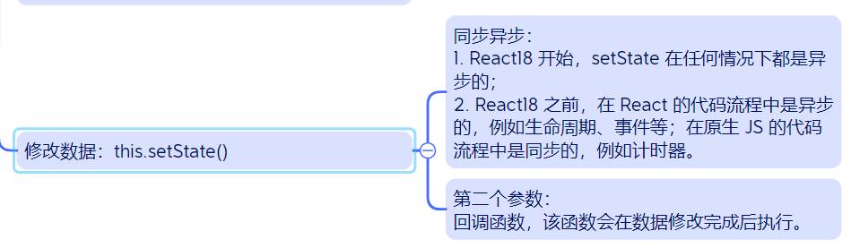

#### 2024.3.12 面试题

---

1. **前端本地存储方式及区别**
   - `localStorage`：保存的数据没有时间限制。
   - `sessionStorage`：数据在页面会话结束时被清除。
   - `cookies`：通常用于存储会话信息，大小限制较小。
2. **常用的 ES6 新特性**
   - `let` 和 `const`、箭头函数、模板字符串、解构赋值、Promise、类、模块化等。
3. **数组的常用 API**
   - 改变原数组的有：`push()`、`pop()`、`shift()`、`unshift()`、`splice()`。
   - 不改变原数组的有：`map()`、`filter()`、`slice()`、`concat()方法中数字追加到新数组末尾`、`indexOf()返回存在元素的下标或-1`、`lastIndexOf()`。
4. **var、let、const 的区别**
   - `var`：函数作用域，可重复声明。
   - `let` 和 `const`：块级作用域，`let` 可重新赋值，`const` 声明常量。
5. **JS 中，浅拷贝和深拷贝的区别**
   - 浅拷贝只复制对象的一层属性，而深拷贝则是完整复制一个**对象**及其**嵌套对象**。
6. **JS 中的基本数据类型和引用数据类型的区别**
   - 基本数据类型（如 String、Number）存储的是值，存储在栈中；引用数据类型（如 Object、Array）存储的是内存地址，存储在堆中。
7. **改变 this 指向的方式及区别**
   - `call()`（第一个参数是要改变的 this 指向的对象，后面的参数是函数执行所需对象）、`apply()`（立即执行函数，`apply()`接受数组作为参数），`bind()`（返回函数的拷贝且可以稍后执行，第二个参数是数组包含了函数执行所需参数）。
8. **JS 实现深拷贝的方法**
   - 通过 JSON 序列化（`JSON.parse(JSON.stringify(object))`），或使用**递归拷贝**每个属性。
9. **CSS 如何实现元素的垂直水平居中？**
   - 使用 `flex` 布局或 `position` 加 `transform` 方法。
10. **Promise 的方法及作用**
    - 如 `then()`、`catch()`、`finally()`、`Promise.all()` 、`race()`、`any()`等，用于处理异步操作。
11. **Vue 组件中的 data 为什么必须是函数**
    - 组件中的 data 选项必须是一个函数而不能是一个对象；以确保每个实例可以维护一份被返回对象的独立的拷贝。
12. **Vue 中实现组件之间的传值（组件通信）**
    - 通过 `props`/`$emit`父传子、`$children`/`$parent`、`$attrs / $listeners`、`Vuex`、`Event Bus`、`provide`/`inject` 等方式。
13. **v-if 和 v-show 指令的区别**
    - `v-if` 是真正的条件渲染；`v-show` 只是切换元素的 `display` 属性。
14. **keep-alive 的作用及特点**
    - 可以让缓存组件不被销毁，常用于保持组件状态或避免重复渲染。新加actived,deactived生命周期
15. **Vuex 的核心属性及作用**
    - 包括 `state`、`getters`、`mutations`、`actions`、`modules`，用于状态管理。
16. **状态机中的数据是否持久化？如何保证刷新后数据不丢失？**
    - 默认不是持久化的，可以通过 `localStorage` 或 `sessionStorage` 等方式来保证刷新后数据不丢失。
17. **Vue2 的响应式原理**
    - 通过 `Object.defineProperty()` 方法对数据的 getter 和 setter 进行劫持，实现数据与视图的双向绑定。
18. **pinia 与 Vuex 的区别**
    - `pinia` 提供了更好的类型推导支持和更简单的 API，是 Vue3 的推荐状态管理库。
19. **Vue 与 React 的区别**
    - 数据绑定和组件化实现的方式不同，Vue 使用的是双向绑定，React 使用的是单向数据流。
20. **Vue 的生命周期**
    - 包括 `beforeCreate`、`created`、`beforeMount`、`mounted`、`beforeUpdate`、`updated`、`beforeDestroy`、`destroyed` 等。
21. **Vue 中如何实现组件的局部样式及原理**
    - 通过 `<style scoped>`，`scoped` 属性确保样式只应用于当前组件。
22. **React 中函数组件和类组件的区别**
    - 函数组件更简单、没有 this 上下文，推荐用于简单的组件；类组件适用于更复杂的组件，可以使用生命周期方法。
23. **React 组件之间如何传值（组件通信）**
    - 通过 `props` 传递数据，也可以使用上下文（`Context`）提供跨组件层级的数据传递。
24. **Redux 的工作流程**
    - 调用 `store.dispatch(action)` → `store` 调用给 `reducer` 的函数 → 根 `reducer` 合并子 `reducer` 输出 → `store` 保存完整状态树。
25. **React 中 setState 是同步还是异步的？**

- 是异步的，React 可能会将多个 `setState()` 调用合并成一个调用来进行优化。

1. **React 类组件性能优化生命周期函数及实现**
   - `shouldComponentUpdate` 方法用于性能优化，通过返回 `false` 来避免不必要的更新。
2. **React.memo、useMemo、useCallback 三者的作用**
   - `React.memo` 是一个高阶组件，用于对组件进行浅比较避免不必要的渲染。`useMemo` 用于缓存复杂函数的返回值，`useCallback` 用于缓存函数。
3. **针对 axios 的封装包括**
   - 设置基础 URL、请求拦截器、响应拦截器、封装不同请求方法等。
4. **GET 和 POST 的区别**
   - `GET` 请求用于请求数据，参数通过 URL 传递；`POST` 用于提交数据到服务器，参数放在请求体中。
5. **浏览器输入 URL 后发生的过程**
   - DNS 解析 → TCP 连接 → 发送 HTTP 请求 → 服务器处理请求并返回 → 浏览器解析响应内容并渲染 → 断开连接。

---

### **浏览器输入 URL 后发生的过程完整版**

1. **`DNS解析`**：将域名解析为IP地址。

2. **`TCP连接`**（包括TCP三次握手）：
    
    - 第一次握手：客户端发送SYN包（同步序列编号）到服务器，并进入SYN_SEND状态，等待服务器确认。
    - 第二次握手：服务器接收到SYN包，必须确认客户的SYN（ack=客户端的SYN+1），同时自己也发送一个SYN包（即SYN+ACK包），服务器进入SYN_RECV状态。
    - 第三次握手：客户端接收到服务器的SYN+ACK包，向服务器发送确认包ACK（ack=服务器端的SYN+1），此包发送完毕，客户端和服务器端进入ESTABLISHED（连接建立）状态，完成三次握手。
    
3. **`发送HTTP请求`**：浏览器向服务器发送一个HTTP请求，包含网页的地址。

4. **`服务器处理请求并返回HTTP响应`**：服务器处理收到的请求，并返回给浏览器所请求的网页内容。

5. **`浏览器解析响应内容并渲染页面`**：浏览器解析返回的内容，并渲染页面。

6. **`断开连接`**（包括TCP四次挥手过程，

    **`第一次挥手`**：客户端发送一个FIN包，用来关闭客户到服务器的数据传送。

    **`第二次挥手`**：服务器收到这个FIN包，发送一个ACK包确认，此时服务器知道客户端没有数据发送了。

    **`第三次挥手`**：服务器准备好关闭连接时，向客户端发送一个FIN包，请求关闭连接。

    **`第四次挥手`**：客户端收到这个FIN包，发送一个ACK包确认，然后等待足够的时间以确保服务器接收到这个ACK包。这段时间等待是为了确保服务器能收到确认关闭请求的包，完成这一过程后，连接关闭。）：

    数据传输完毕后，进行断开连接的操作，确保双方都没有数据要发送，然后关闭连接。