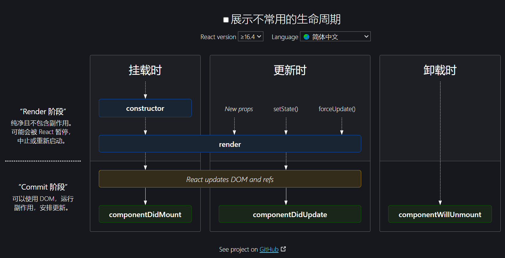

# Vue.js 面试题

### 1、Vue 中可以实现数据渲染的方式有哪几种？区别是什么？

1. &#123;&#123;   &#125;&#125;
   - 渲染新数据时，**不会**将标签内的旧数据覆盖掉；
   - 渲染数据时，**无法解析**数据中的 HTML 标签，会将字符串中的 HTML 标签当作普通文本进行渲染；
2. `v-text`
   - 渲染新数据时，**会**将标签内的旧数据覆盖掉；
   - 渲染数据时，**无法解析**数据中的 HTML 标签，会将字符串中的 HTML 标签当作普通文本进行渲染；
3. `v-html`
   - 渲染新数据时，**会**将标签内的旧数据覆盖掉；
   - 渲染数据时，**可以解析**数据中的 HTML 标签；

### 2、描述 v-if 和 v-show 的相同点和不同点，以及各自的应用场景。

相同点：v-if 和 v-show 都可以用来控制元素节点在页面中的显示和隐藏。

不同点：

1. `v-if`：用来控制元素节点在节点树中的**销毁和重建**；当 `v-if` 的初始值为 false 时，节点不会添加渲染到页面中；
2. `v-show`：用来控制元素节点在页面中的**显示和隐藏**；当 `v-show`的初始值为 false 时，节点会先渲染到页面中，然后在节点上添加 `display: none` 的 CSS 样式，来实现元素的隐藏；

应用场景：

1. `v-if` 初始渲染的性能消耗小，因此如果**不需要频繁**的进行“显示/隐藏”**切换**，建议使用 `v-if`；
2. `v-show` 频繁切换性能消耗小，因此如果**需要频繁**的进行“显示/隐藏”**切换**，建议使用 `v-show`；

### 3、computed 和 methods 的区别。

1. 功能：computed 是属性，用来计算得到一条新数据；methods 是方法。
2. 有没有缓存：computed 可以缓存数据，methods 不能。
3. 有没有返回值：computed 必须设置返回值，methods 没有要求。
4. 是否支持异步：computed 不支持异步，methods 支持异步。

### 4、computed 和 watch 的区别。

1. 功能：computed 是属性，用来计算得到一条新数据；watch 是侦听器，用来侦听指定数据的变化。
2. 有没有缓存：computed 可以缓存数据，watch 不能。
3. 有没有返回值：computed 必须设置返回值，watch 没有要求。
4. 是否支持异步：computed 不支持异步，watch 支持异步。

### 5、Vue 响应式系统中无法检测到数据的哪些变化？解决方案是什么？

问题分析：

组件 data 中的数据会自动加入到响应式系统中，从普通数据变成响应式数据。

响应式数据的特点是：当数据发生改变时，Vue 内部会自动检测到数据的变化，同时更新对应的节点。

因此，如果有一些响应式数据的变化，Vue 检测不到，出现的问题就是：数据发生了改变，但是页面的节点不会更新。

参考答案：

Vue 响应式系统检测不到以下四种数据的变化：

1. 对象属性的新增：`$set()`、赋值新对象 + 扩展运算符（扩展旧对象，保留旧属性）
2. 对象属性的删除：`$delete()`
3. 通过下标操作数组：`$set()`、`splice()`
4. 修改数组的长度：`splice()`

### 6、Vue 组件之间的传值方式。

1. 父子传值：`props/$emit() 自定义事件`、`$children/$parent`
2. 兄弟传值：事件总线、通过共同的父组件传值
3. 多级嵌套传值：`provide/inject`、`$sttrs/$listeners`
4. 状态机传值：Vuex

### 7、什么是单向数据流。

“数据流”指的是父组件传递数据给子组件，当父组件的数据发生了改变，数据的改变会向下流动到子组件，子组件中的数据也会更新。

“单向”指的是父组件可以改变数据，来影响子组件，但是返回来则不行，**子组件不能修改 props 的数据。**

### 8、$router 和 $route 的区别。

1. `$router`：**整个应用程序**的路由**实例**对象，主要用于提供路由相关的方法，包括路由跳转、导航守卫、动态添加路由...等方法。
2. `$route`：**当前页面**的路由**信息**对象，主要用于提供用户当前访问页面的路由信息，包括路由路径、名称、参数、元信息...等数据；

### 9、Vue 的常用指令。

- v-on：事件绑定
- v-bind：绑定动态属性
- v-if、v-else、v-else-if、v-show：条件渲染
- v-for：列表渲染
- v-model：双向数据绑定
- v-text、v-html：数据渲染
- v-slot：插槽

### 10、Vue 组件中的 data 为什么必须是函数。

Vue 组件是可以复用的。

如果组件中的 data 是对象，那么组件复用时，每个组件之间共用同一个对象，其中任意一个组件修改了 data 对象中的数据，其他组件都**会**受到影响。

如果组件中的 data 是函数，那么组件复用时，每次都会调用 data 函数，来得到一个新的对象。其中任意一个组件修改了 data 对象中的数据，其他组件**不会**受到影响。

### 11、Vue 组件的生命周期。

- beforeCreate：组件创建前
- created：组件重建完成
- beforeMount：组件挂载前
- mounted：组件挂载完成
- beforeUpdate：组件更新前
- updated：组件更新完成
- beforeDestroy：组件销毁/卸载前
- destroyed：组件销毁完成

### 12、keep-alive 的作用。

- 作用：缓存组件
- 属性：
  - include：设置需要缓存的组件名称
  - exclude：设置不需要缓存的组件名称
  - max：设置缓存组件的最大数
- 新增两个生命周期
  - activated：进入组件时触发
  - deactivated：离开组件时触发

### 13、Vue Router 路由跳转。

- 标签/组件跳转：`<router-link>`
- 方法跳转：`this.$router.push()`、`this.$router.replace()`

### 14、Vue Router 路由传参。

- 动态路由：
  - 传递参数：路径/参数
  - 接收参数：`this.$route.params`
- query 传参：
  - 传递参数：路径?参数名=参数值
  - 接收参数：`this.$route.query`

### 15、Vue 父子组件生命周期执行的顺序。

组件首次挂载：

1. 父组件：beforeCreate、created、beforeMount
2. 子组件：beforeCreate、created、beforeMount、mounted
3. 父组件：mounted

父组件更新：

1. 父组件：beforeUpdate
2. 子组件：beforeUpdate、updated
3. 父组件：updated

父组件销毁：

1. 父组件：beforeDestroy
2. 子组件：beforeDestroy、destroyed
3. 父组件：destroyed

### 16、Vue 组件中如何实现局部样式？以及原理。

实现：给 style 标签身上添加 scoped 属性。

原理：scoped 会给当前组件中所有的 HTML 标签和 CSS 选择器添加一个唯一值。

### 17、$route 和 $router 的区别。

- `$route`：路由信息对象，用来获取**当前页面**路由的相关信息，例如路由路径、名称、参数、元信息...
- `$router`：路由实例对象，是当前整个应用程序的路由对象，提供路由的相关方法，例如路由跳转、导航守卫、动态添加路由...

### 18、Vuex 的五大核心属性。

1. state：保存公共数据；
2. getters：保存公共的计算属性；
3. mutations：保存**修改 state** 的**同步**方法；
4. actions：保存公共的异步方法；
5. modules：仓库模块化；
