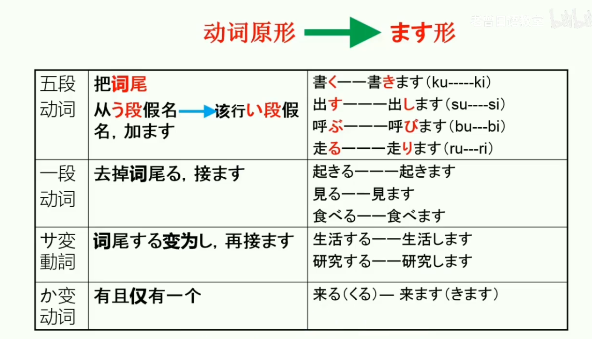

# 日语动词的变形
|    形式     |                           一类动词                           |        二类动词         |            三类动词            |
| :---------: | :----------------------------------------------------------: | :---------------------: | :----------------------------: |
| 原型/基本型 | 结尾是う段，あ段+る，う段+る，お段+る，`特例:切る、帰る、走る、知る` |    い段+る、え段+る     |             n+する             |
|   ます形    |                     う段 -> い段　+ます                      |       る -> ます        |  来る -> 来ますする -> します  |
|    て形     | す->して，く->いて，ぐ->いで，る、う、つ->って，ぬ、む、ぶ->んで |         る->て          |     する->して，来る->来て     |
|    た形     | す->した，く->いた，ぐ->いだ，る、う、つ->った，ぬ、む、ぶ->んだ |         る->た          |     する->した，来る->来た     |
|   未然形    |                     う段->あ段`(う->わ)`                     |      去掉结尾的る       |   来る->こ，する->し、せ、さ   |
|   命令形    |                          う段->え段                          |         る->ろ          |     来る->来い，する->しろ     |
|   意志形    |                  う段->お段 并且加上长音う                   |        る->よう         |   来る->来よう，する->しよう   |
| 假定形/ば形 |                       う段变为え段＋ば                       |       る变为れば        | 来る变为来れば，する变为すれば |
|   可能形    |                       る段变为え段+る                        |   去掉词尾的る+られる   |        来られる，できる        |
|   被动形    |                      る段变为あ段+れる                       |   去掉词尾的る+られる   |        来られる，される        |
|   使役形    |                      る段变为あ段+せる                       |   去掉词尾的る+させる   |        来させる，させる        |
| 使役被动形  |                   使役形去词尾的る+られる                    | 使役形去词尾的る+られる |    使役形去词尾的る+られる     |

### 老曾日语总结：

口诀1：词尾不是る结尾的一定是五段动词（1类）

口诀2：词尾为する结尾的，为サ变动词（3类动词）、か变动词仅一个：來る（3类动词）

###### 一般是动名词+する，拿掉する就是名词的就是动名词。一般是汉字词汇+する，有的是外来语+する

口诀3：る前一个假名不是い段或え段的一定是五段动词（1类动词）

口诀4：汉字+え段假名+る的一定为一段动词（2类动词），え段假名一定不是汉字的读音或汉字读音的一部分，它是单独写出来的。

口诀5：汉字+い段假名+る的99%为一段动词（2类动词），极少特例如混じる为五段动词（1类动词）

口诀6：汉字后面直接+る的直接死记硬背 例如見る一段动词（2类动词） 帰る五段动词（1类动词）

评论区置顶：

五段动词：
1.不是る结尾的动词一定是五段动词。立（た）つ、話（はな）す、買（か）う。
2.る结尾的动词，る前一个假名不是い或者え段的，一定是五段动词。終わる　（おわる）、渡る（わたる）、寄る（よる）。
一段动词：
1.汉字+え段假名+る是一段动词。食べる（食べる）、見せる（みせる）
2.汉字+い段假名+る＋99.9%是一段动词。（极极少特例：混じる（五段）。起きる（起きる）、降りる（おりる）
サ变动词：
词尾为する结尾的是サ变动词。生活する、研究する。
か变动词：
只有一个来る

#### 其余“汉字+る”的动词死记硬背为佳：

#### 見る（一段），帰る（五段），要る（五段）

---

### 特殊五段动词八大天王，死记硬背就好了，其它的不经常用。

> 要走滑入，减切知归（要る、走る、滑る、入る、減る、切る、知る、帰る）

**特殊的五段动词（26个）**

> 1帰（かえ）る【回来、回去】　
> 2切（き）る【切】　
> 3减（へ）る【减少】
> 4要（い）る【需要】　　
> 5知（し）る【知道、认识】　
> 6走（はし）る【跑、行驶】
> 7入（はい）る 【进入】
> 8返（かえ）る 【返还】
> 9滑（すべ）る 【滑】
> 10参（まい）る【”来、去“的自谦语】
> 11混（ま）じる【夹杂】
> 12握（にぎ）る【握】
> 13煎（い）る【煎、炒】　
> 14练（ね）る【推敲】　
> 15散（ち）る【凋谢】　　
> 16照（て）る【照耀】　
> 17蹴（け）る【踢】
> 18焦（あせ）る【着急】
> 19限（かぎ）る【限于】
> 20湿（しめ）る【潮湿】
> 21茂（しげ）る【茂盛】
> 22遮（さえぎ）る【遮住】　
> 23骂（ののし）る【骂】　
> 24嘲（あざけ）る【嘲笑】　　
> 25涨（みなぎ）る【充满】　
> 26覆（くつがえ）る【被推翻】

